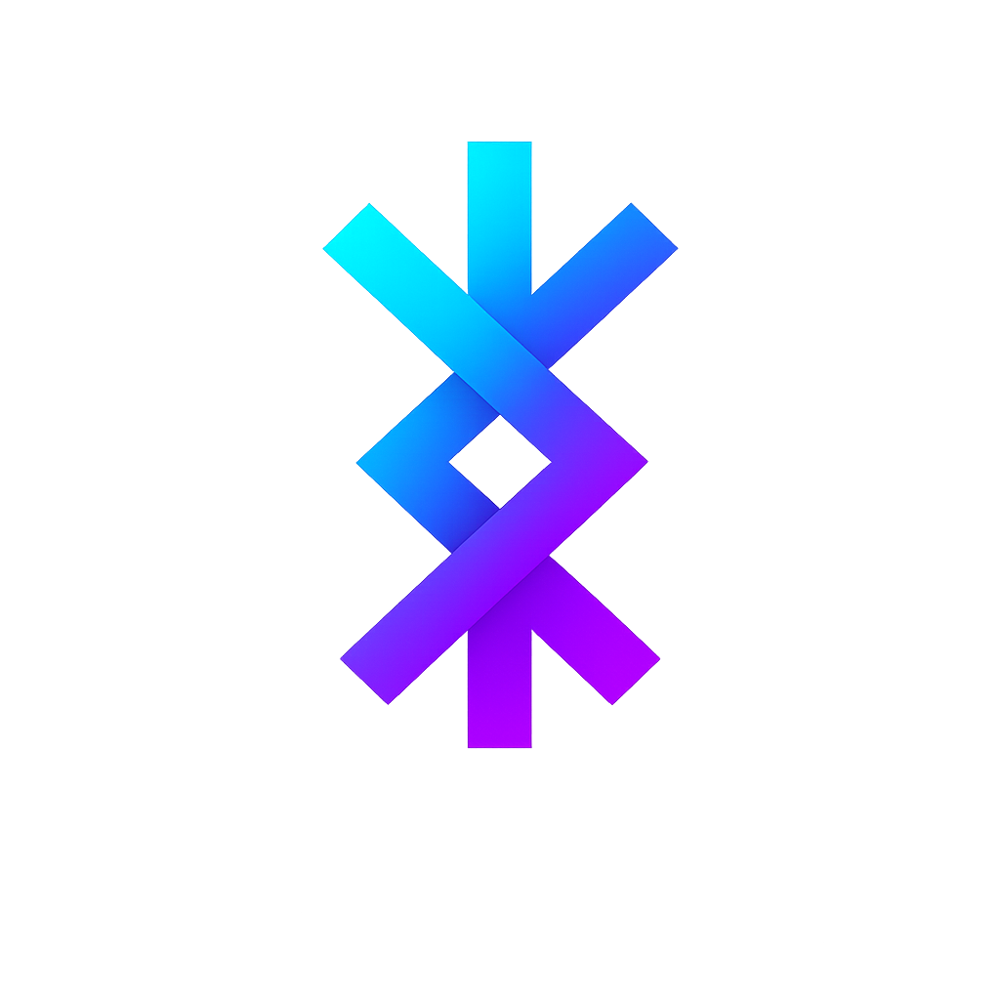

<p align="center">
  
</p>

# ᚼᚢᚴᛦ - (/ˈhuɡr/)
[](LICENSE)


**A local-first memory suite for AI agents.** One install gets you a
two-tier memory store, an M365 read/write surface, and a single CLI
that ties them together. Your data stays on your machine.

`hugr` is the umbrella over four independent tools that already work
on their own. The umbrella adds one verb surface, one install command,
one place to find what is in the box.

The name `hugr` is from Old Norse, where it means "mind, thought, sense" - and in the Norse conception of self,
specifically the part of the mind that can travel outside the body
to see and act on distant things.  
The wordmark in Younger Futhark is ᚼᚢᚴᛦ: hagall, úr, kaun, yr.

```
                            hugr (meta-CLI + suite hub)
                                       |
              +------------------------+------------------------+
              |               |                |                |
            YAAMS    cognitive-ledger    owa-piggy        owa-tools
         (Tier 1 raw) (Tier 2 curated)  (M365 auth)   (M365 read/write)
```

## What's in the box

| Tool | Purpose | Binaries |
| --- | --- | --- |
| [**YAAMS**](https://github.com/damsleth/yaams) | Tier 1 raw memory store - every iMessage, mail, calendar event, GitHub issue, ingested and queryable from a single SQLite file. | `yaams` |
| [**cognitive ledger**](https://github.com/damsleth/cognitive-ledger) | Tier 2 curated atomic notes engine - the gems you promote out of YAAMS and keep forever as markdown with frontmatter. | `ledger`, `ledger-obsidian`, `sheep` |
| [**owa piggy**](https://github.com/damsleth/owa-piggy) | Microsoft 365 auth broker - turns your existing Outlook Web session into a reusable token. No app registration. | `owa-piggy` |
| [**owa tools**](https://github.com/damsleth/owa-tools) | M365 read/write CLI suite - calendar, mail, Graph, OneDrive, scheduling, people lookup, all JSON-by-default. | `owa`, `owa-cal`, `owa-mail`, `owa-graph`, `owa-doctor`, `owa-people`, `owa-sched`, `owa-drive` |

`hugr` itself adds one more binary that routes the verbs above into
a single user-facing surface, plus a `hu` symlink for typing speed.

## Install

```bash
brew install damsleth/tap/hugr
```

The Homebrew formula pulls the whole suite via dependencies. On
PyPI the package is `hugr-cli` (the bare name `hugr` was already
taken on PyPI by an unrelated project); the installed binary
is `hugr`, with `hu` as a short alias:

```bash
pipx install hugr-cli
```

Then:

```bash
hugr init --quick   # non-interactive bootstrap for the common path
hugr init           # interactive wizard when you want prompts
hugr hello          # one-screen tour of the verbs
hugr doctor         # health check across every tool
hugr doctor --fix --yes # apply bounded self-healing fixes
```

`hugr init --quick` writes hugr-owned config, adopts existing tool
configs in place, and skips heavyweight model downloads unless you
pass `--with-models`. `hugr init` is idempotent and never edits your
existing tool dotfiles.

## What can it do

```bash
hugr recall "what did we decide at the brand kickoff?"
hugr find person nina
hugr inbox                       # unread mail, today's events, loops, promotions
hugr remember "Nina prefers early flights" --yes
hugr web                         # local browser UI, requires [web] extra
hugr query "what did we decide at the brand kickoff?"  # direct YAAMS passthrough
hugr ingest                       # all configured sources, partial-success tolerant
hugr promote review               # interactive: promote YAAMS gems to the ledger
hugr mail send --to ...           # owa-mail wrapper
hugr cal today                    # owa-cal wrapper
hugr ledger init                  # bootstrap a new ledger
hugr auth status                  # owa-piggy wrapper
hugr doctor                       # aggregate health check
hugr version                      # own version + observed component versions
```

Every JSON-capable command accepts `--json` (machine mode) and
`--pretty` (human rendering). Exit codes are predictable per
[CONVENTIONS.md](CONVENTIONS.md): 0 ok, 1 user error, 2 transient,
3 auth, 4 not found, 5 partial success.

## First day

1. `brew install damsleth/tap/hugr`
2. `hugr init --quick` - probes for iMessage, Apple Mail, Signal,
   GitHub, owa-piggy, Obsidian, and an existing cognitive-ledger. It
   enables what it finds, adopts existing configs byte-for-byte, and
   prints hints for what it cannot bootstrap.
3. `hugr ingest` - first run downloads embedding models (~2 GB) with
   a prompt before any download.
4. `hugr recall "..."` - ask the suite anything.

See [SUITE.md](SUITE.md) for the full data flow and architecture, and
[CONVENTIONS.md](CONVENTIONS.md) for the CLI contract every tool in
the suite conforms to.

## Config

`hugr` keeps its master config at `$XDG_CONFIG_HOME/hugr/config.toml`
(typically `~/.config/hugr/config.toml`). The file is flat TOML,
generated by `hugr init`, and records pointers to the per-tool
configs (yaams, ledger, owa-piggy) without owning them. Each tool
keeps its own data lives - hugr coordinates, never centralizes.

## Surfaces

The CLI is always installed. Optional surfaces stay behind extras:

```bash
pipx install "hugr-cli[tui]"    # hugr tui
pipx install "hugr-cli[web]"    # hugr web
pipx install "hugr-cli[server]" # hugr server
```

`hugr web` binds to `127.0.0.1:7777` by default. Binding to a public
interface requires `--public` and `HUGR_WEB_TOKEN`; put a real access
proxy such as Cloudflare Access or tailscale in front for remote use.
`hugr server` uses the same web app as the deployable runtime and
refuses non-loopback binds unless you pass `--insecure` or set
`HUGR_AUTH_PROXY=cloudflare|tailscale|none`.

## Skills

Two agent skill repos sit on top of `hugr`:

- [`damsleth/SKILLS`](https://github.com/damsleth/SKILLS) - public,
  reusable agent skills. Includes `/memory`, which routes through
  `hugr`.
- `damsleth/SKILLS-private` - personal-infra `cj-*` skills (timereg,
  did, weekly review). Same installer pattern; private repo.

Skills wrap `hugr`. `hugr` does not call skills. One direction, no
circular dependencies.

## License

MIT. See [LICENSE](LICENSE).
